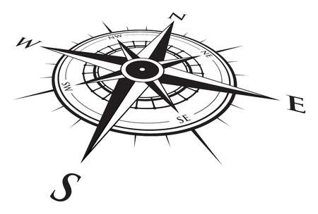

# About

{ width="300" align=right }

## Overview

**RENware** was established in 2020 as software development company. Then it extended the activity portfolio to systems integration, architectures design, software engineering, IT projects management, infrastructure systems and more, following its [competencies list](services.md#competencies).

**RENware Software Systems** division is a place of innovative and enthusiastic people that like to dedicate part of their time to study and research growing their knowledge in computing industry.

It is a place for people who love their work and what they do. It is a place for all those who want to share a respectable conduit and a honour code related to computer domains being hardware, software, networking, security, and so on.

## Our vision

{ width="300" align=right }

:fontawesome-solid-universal-access: **Innovation. Creativity. Add & Share Value.**

<small markdown>
>“*The true sign of intelligence is not the knowledge but imagination.*” *Albert Einstein*
</small>

* We believe that adding value is a valuable process.
* We believe that education for creativity is a valuable asset.
* We believe that creating a vision and a story about an idea is the right way to to put it into practice.
* Our vision is to create useful software.
* Our vision is to create useful & scalable systems.

## The team

<table markdown>
<tr markdown>

<td markdown>
**Production teams composition** 
software developers, software engineers, technical leaders, project managers, business analysts & consultants
</td>

<td markdown>
**support teams composition** 
commercial & contracts follow-up, technical support assistants, financial operations, legal, administrative operations
</td>

</tr>
</table>

## Competencies



