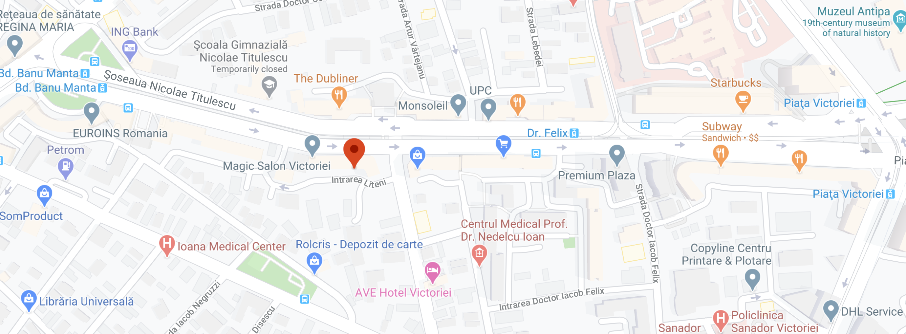

# Contact

## Date legale ale companiei RENware Systems (Legal company data)

* Denumirea oficiala (company legal name): REN-CONSULTING SOFT ACTIVITY SRL
* Nume comerciale (aliases, commercial names): RENware Systems, RENware Software Systems, RENware
* CUI (company ID): 42561459
* Atribut fiscal (fiscal VAT suffix): RO
* Nr Registrul comertului (company registratuon number): ROONRC J40/5662/2020
* Adresa sediu administrativ (headquarter address): Bucuresti, Sector 1, sos Nicolae Titulescu 81-87, bl 10, sc B, ap 58

## Date de contact (contact info)

{ width="500" align=left }

* address: RO, Bucharest 1, Nicolae Titulescu 81-87
* phone: +(40) 744-684.867
* e-mail: office@renware.eu, renware.systems@gmail.com, petre.iordanescu@gmail.com

